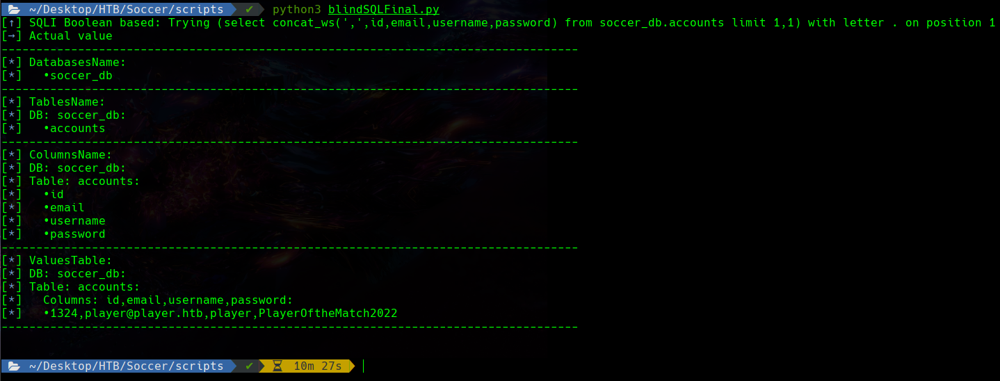

# SQLI_Websocket

Es una utilidad que permite encontrar todas las bases de datos, junto con sus tablas, columnas y todas las filas existentes. Originalmente fue creado para la máquina "Soccer" de "Hack The Box". Cualquiera es libre de copiarlo y modificarlo a su gusto.

Tiene las dos formas de blind SQLI, **timed based** y **boolean based**.

---

It is an utility that allows you to find all databases, along with their tables, columns and all existent rows. It was originally created for the "Soccer" machine of "Hack The Box". Feel free to copy and modify it as you need.

There are two ways scripted, **timed based** and **boolean based**.

## Ejemplos/Examples

### Boolean based

### Timed based

