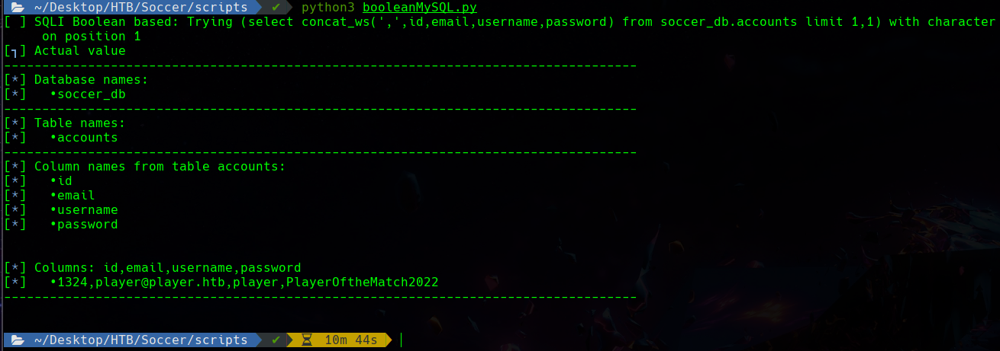
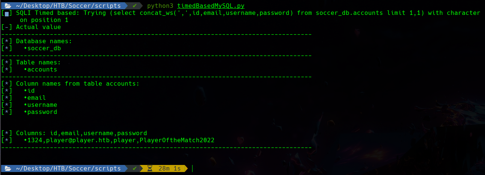
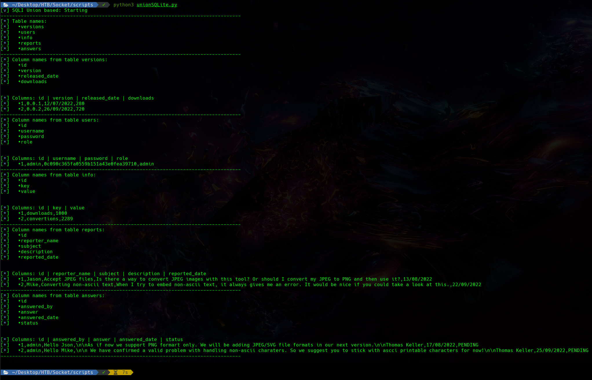

# SQLI_Websocket

Es una utilidad que permite encontrar todas las bases de datos, junto con sus tablas, columnas y todas las filas existentes. Originalmente fueron creados para la máquina "Soccer" y "Socket" de "Hack The Box". Cualquiera es libre de copiarlo y modificarlo a su gusto.

Tiene las dos formas de blind SQLI para MySQL, **timed based** y **boolean based**.
Y tiene **union based** para SQLite.

---

It is an utility that allows you to find all databases, along with their tables, columns and all existent rows. They was originally created for the "Soccer" and "Socket" machine of "Hack The Box". Feel free to copy and modify it as you need.

There are two ways scripted for MySQL, **timed based** and **boolean based**.
And it has **union based** for SQLite.

## Ejemplos/Examples

### Boolean based (MySQL)

### Timed based (MySQL)

### Union based (SQLite)
